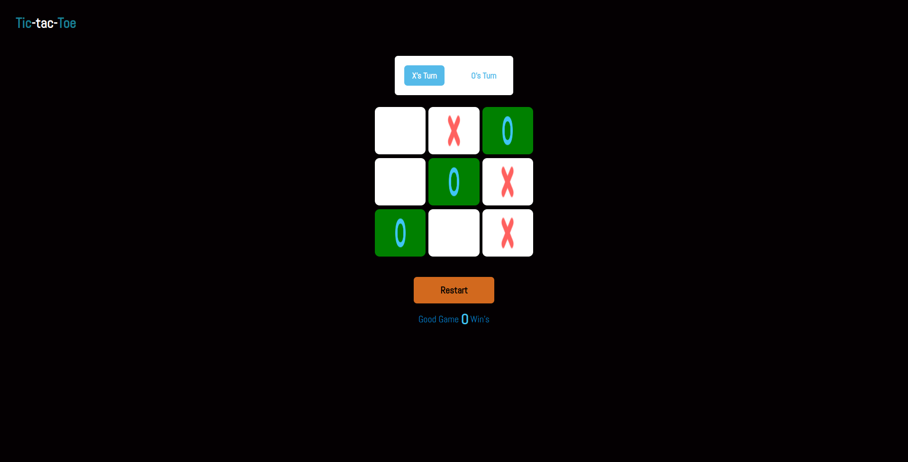

# My Project

This is a simple tic-tac-toe game implemented in React JS. It allows two players to play against each other on the web.

## Getting Started

To get started with this project, follow these steps:

1. Clone the repository: `git clone https://github.com/your-username/your-repo-name.git`
2. Install dependencies: `npm install`
3. Start the development server: `npm start`

## Technologies Used

This project was built using the following technologies:

- React Js
- tailwind css

## Usage

Here is an example of how to use my project:

## Contributing

If you would like to contribute to this project, please follow these steps:

1. Fork the repository
2. Create a new branch: `git checkout -b my-new-feature`
3. Make your changes and commit them: `git commit -am 'Add some feature'`
4. Push to the branch: `git push origin my-new-feature`
5. Create a new pull request

## License

This project is licensed under the MIT License. See the [LICENSE](LICENSE) file for details.
